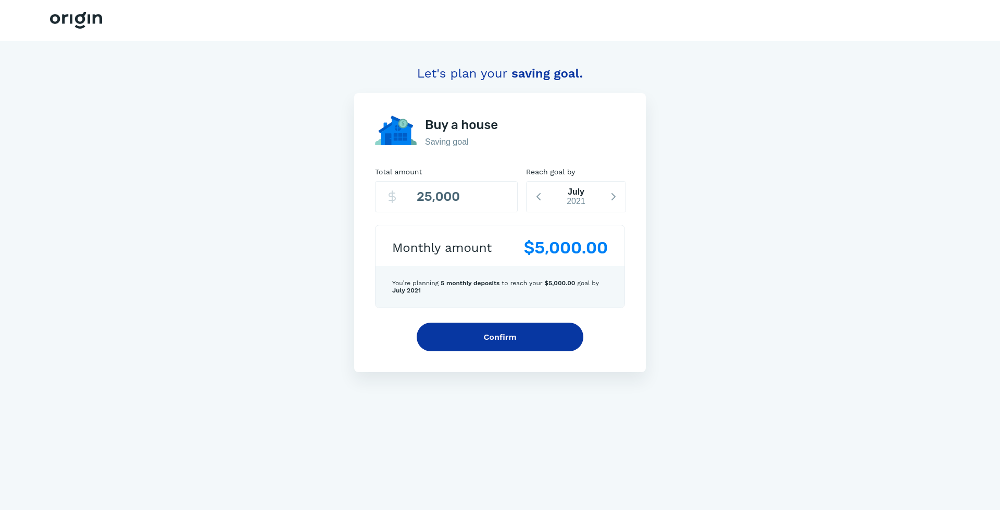

<h1 align="center">
Saving Goal simulator
</h1>

One key to financial well-being is planning & saving for your goals. Users can have many saving goals (e.g. go to college or throw a wedding party) and it is our job to help them accomplish it.

  
  

you can acccess a deployed version of the app <a href="https://jovial-curie-8354cb.netlify.app" target="_blank" rel=" noopener noreferrer">by clicking here</a>

## Participants

|  |
| :----------------------------------------------------------------------------------------------------------------------------------------------------------------: |

| [Gabriel Eloy](https://github.com/gabrielEloy)

## Getting started

1. Clone this repository; 
2. Run `npm or yarn install` at each project in order to install dependencies. 
3. Run `npm run start` or `yarn start`. 
4. Access `localhost:3000` in your browser. 

## Contributing

Please read [CONTRIBUTING.md](CONTRIBUTING.md) for details on our code of conduct, and the process for submitting pull requests.
